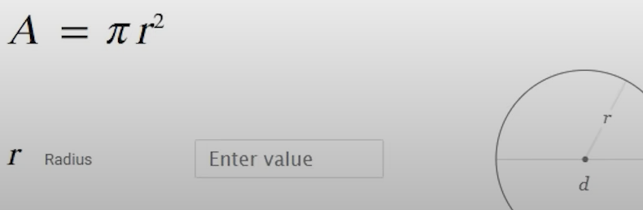
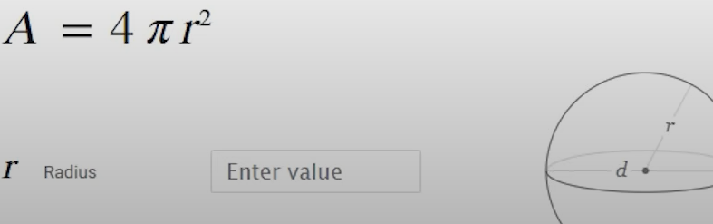
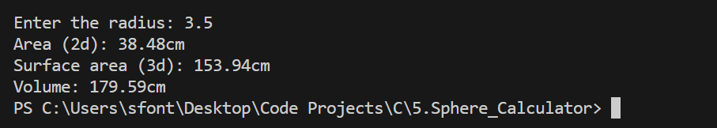

  

# 💻 Project 1 – Sphere Calculator (in C)

This is **Project 1** in a series of mini exercises for **beginners learning C programming**. Each project in the series helps you practice essential programming concepts such as variables, user input/output, mathematical formulas, and the use of standard libraries.

---

## 📌 About this project

This mini project is a **sphere calculator**, designed to compute the 2D area of a circle, the 3D surface area, and the volume of a sphere based on a given radius.

The program prompts the user to enter the **radius of the sphere**, and then uses well-known mathematical formulas to calculate:

- The area of a circle (2D projection)
- The surface area of the sphere (3D)
- The volume of the sphere

This exercise is ideal for reinforcing the use of `math.h`, especially the `pow()` function, and for practicing mathematical expressions and formatted output in C.

---

## 📘 Formulas used

The following formulas are used in this project:

### 🔵 2D – Circle Area:

---

### 🟣 3D – Volume of a Sphere:

---

## 🧪 Example Output

Here is a sample of what the final terminal output should look like when the program is run:

---

## 🧠 Challenge Instructions

If you'd like to practice building this yourself before reviewing the solution, here’s how to get started:

1. Prompt the user to enter the radius of a sphere.
2. Use the `pow()` function to apply the formulas for:
   - Area of the circle (2D)
   - Surface area of the sphere (3D)
   - Volume of the sphere
3. Print all results clearly, formatted to two decimal places and with appropriate units.

> **Note:** This project is already complete and includes the full solution. You can explore the code in `main.c` and refer to the example images above for guidance.

Happy coding! 🚀
